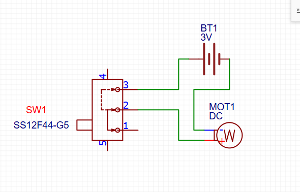

# 🩷🌀 Mini Ventilador DC

> Um pequeno projeto de eletrônica construído com materiais
> reaproveitados e muita experimentação.

---

## 🌸 Sobre o projeto

A ideia foi construir um mini ventilador utilizando um motor DC,
um interruptor e materiais simples que eu tinha disponíveis.

O projeto também foi uma oportunidade para aprender, na prática,
como identificar o funcionamento de um componente desconhecido
utilizando um multímetro.

## 🎀 Materiais utilizados

### ⚡ Componentes eletrônicos

- 🔋 Suporte para 2 pilhas AA
- 🔋 2 pilhas AA
- ⚙️ Motor DC
- 🎚️ Interruptor deslizante (SPDT)
- 🔌 Fios

### 🩷 Materiais para a estrutura

- 📦 Papelão
- 🧴 Tampas de garrafa
- 🩷 Cola
- 🎀 Fita adesiva
- ♻️ Materiais reaproveitados

## 🔌 Como funciona

O circuito é formado por:

**🔋 Bateria → 🎚️ Interruptor → ⚙️ Motor → 🔋 Bateria**

As duas pilhas AA fornecem aproximadamente 3 V para o motor.

Ao deslizar o interruptor para a posição correta, o circuito é
fechado e o motor recebe energia.

Ao mudar a posição do interruptor, o circuito é interrompido
e o motor para.

## 🔎 A descoberta do interruptor

Uma das partes mais interessantes do projeto foi descobrir como
funcionava o interruptor utilizado.

Eu retirei o componente de outra peça que seria descartada,
com o objetivo de reaproveitá-lo.

Como eu não sabia quais eram suas conexões, utilizei um multímetro
na função de continuidade para investigar o componente.

Durante os testes, percebi que:

- Os pinos 1 e 5 apresentavam continuidade nas duas posições;
- Em uma posição, os pinos 2 e 3 apresentavam continuidade;
- Ao deslizar o interruptor, os pinos 3 e 4 apresentavam continuidade.

A partir desses testes, consegui entender o funcionamento do
interruptor e descobrir quais contatos poderiam ser utilizados
no projeto.

## 📐 Esquemático

O circuito foi desenhado no EasyEDA.

## 🎥 Demonstração

Gravei um vídeo mostrando o funcionamento e o processo de montagem
do mini ventilador.

> 🎀 Vídeo: [▶️ Assistir ao vídeo](ventilador.mp4)

## 🌱 O que aprendi

- Testar continuidade com um multímetro
- Identificar conexões de um componente desconhecido
- Entender o funcionamento de um interruptor SPDT
- Identificar polaridade de uma bateria
- Alimentar um motor DC
- Criar um esquemático no EasyEDA
- Reaproveitar componentes eletrônicos
- Construir uma estrutura utilizando materiais simples

## ♻️ Reaproveitamento

O projeto foi feito pensando também no reaproveitamento.

O interruptor veio de uma peça que seria descartada e materiais
como papelão e tampas de garrafa foram utilizados na construção
da estrutura.

Assim, foi possível transformar materiais que seriam descartados
em um novo projeto.

---

### 🩷 Projeto desenvolvido para aprender, testar e construir.
